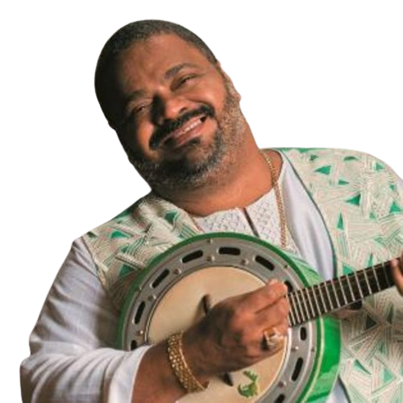

---
---

- 
- | **Full Name**     | Arlindo Domingos da Cruz Filho      |
  |-------------------|-------------------------------------|
  | **Date of Birth** | September 14, 1958                  |
  | **Place of Birth**| Rio de Janeiro, RJ, Brazil          |
  | **Genres**        | Samba, Partido-Alto, Pagode, MPB    |
  | **Occupations**   | Musician, Composer                  |
  | **Active Years**  | 1981–2017                           |
  | **Record Label**  | Universal Music                     |
- ## **Biography**
	- Arlindo Domingos da Cruz Filho, known as Arlindo Cruz, is a celebrated Brazilian musician and composer, renowned for his contributions to samba and pagode. Born in Rio de Janeiro, Arlindo began playing the cavaquinho at a young age and was deeply influenced by the musical environment of the Cacique de Ramos. He played a significant role in the samba group Fundo de Quintal before embarking on a successful solo career.
- ## **Career Highlights**
	- **Early Career (1981):** Joined the samba group Fundo de Quintal.
	- **Solo Career (1993):** Began a solo career, releasing several acclaimed albums.
	- **MTV Ao Vivo (2009):** Released a live album and DVD, cementing his status in Brazilian music.
	- **Health Struggles (2017):** Suffered a severe stroke, leading to a long recovery process.
- ## **Artistic Style and Impact:**
	- Arlindo Cruz's music blends traditional samba with contemporary elements, showcasing his mastery of the cavaquinho and banjo. His lyrical themes often explore love, life, and the cultural richness of Brazil. He is recognized for his ability to bridge generations of samba musicians, bringing new life to the genre while honoring its roots.
- ## **Gallery**
	- <iframe width="560" height="315" src="https://www.youtube.com/embed/K7KpgDc2YLQ?si=a0Fyf2TmZYXZ58iC" title="YouTube video player" frameborder="0" allow="accelerometer; autoplay; clipboard-write; encrypted-media; gyroscope; picture-in-picture; web-share" referrerpolicy="strict-origin-when-cross-origin" allowfullscreen></iframe>
	- <iframe width="560" height="315" src="https://www.youtube.com/embed/WL5eFEKUcPQ?si=BDMIu3LcNkxMngsF" title="YouTube video player" frameborder="0" allow="accelerometer; autoplay; clipboard-write; encrypted-media; gyroscope; picture-in-picture; web-share" referrerpolicy="strict-origin-when-cross-origin" allowfullscreen></iframe>
	- <iframe width="560" height="315" src="https://www.youtube.com/embed/fK3-ZtUT-RI?si=GXrnLZvZ-FW8JBii" title="YouTube video player" frameborder="0" allow="accelerometer; autoplay; clipboard-write; encrypted-media; gyroscope; picture-in-picture; web-share" referrerpolicy="strict-origin-when-cross-origin" allowfullscreen></iframe>
	- ## Similar artists
		- | Influenced By       | Influenced           |
		  |---------------------|----------------------|
		  | [[Candeia]]         | Zeca Pagodinho       |
		  | [[Beth Carvalho]]   | Sombrinha            |
		  | [[Jorge Aragão]]    | Arlindo Neto         |