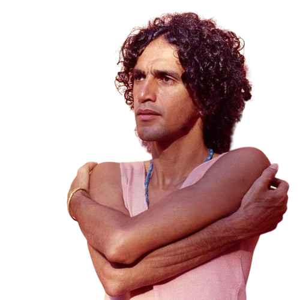

---
---

- 
- | **Full Name**     | Caetano Emanuel Viana Teles Veloso  |
  |-------------------|--------------------------------------|
  | **Date of Birth** | August 7, 1942                       |
  | **Place of Birth**| Santo Amaro, BA, Brazil              |
  | **Genres**        | MPB, Tropicalia, Psychedelic Rock, Folk Rock, Bossa Nova |
  | **Occupations**   | Singer, Musician, Producer, Arranger, Writer |
  | **Active Years**  | 1965–present                         |
  | **Record Labels** | RCA Victor, Philips, Polygram, Nonesuch, Universal Music, Sony Music |
- ## **Biography**
	- Caetano Emanuel Viana Teles Veloso, born on August 7, 1942, in Santo Amaro, Bahia, Brazil, is a renowned Brazilian singer, composer, and producer. Veloso's career spans over five decades, marked by innovation and a blend of various musical styles. He is a key figure in the Tropicalia movement and one of the most influential Brazilian artists of all time. His notable works include "Alegria, Alegria," "Tropicália," and "Sozinho."
- ## **Career Highlights**
	- **1967:** Released debut LP *Domingo* with Gal Costa.
	- **1968:** Led the Tropicalia movement with the album *Tropicalia ou Panis et Circencis*.
	- **1971:** Released the album *Caetano Veloso* during exile in London.
	- **1989:** Released the critically acclaimed album *Estrangeiro*.
	- **2000s:** Continued to release influential albums and received multiple Grammy Awards.
- ## **Artistic Style and Impact**
	- Veloso's music combines diverse genres, creating a unique sound that has deeply influenced Brazilian and global music. His work is known for its poetic lyrics and innovative compositions, making him a revered figure in the music world.
- ## **Gallery**
	- <iframe width="560" height="315" src="https://www.youtube.com/embed/sGC8g0DJ0_E?si=X-fEG_7lBYSgOt0d" title="YouTube video player" frameborder="0" allow="accelerometer; autoplay; clipboard-write; encrypted-media; gyroscope; picture-in-picture; web-share" referrerpolicy="strict-origin-when-cross-origin" allowfullscreen></iframe>
	- <iframe width="560" height="315" src="https://www.youtube.com/embed/-jzHwhWeWCI?si=eS7-0ycyLNFTiArn" title="YouTube video player" frameborder="0" allow="accelerometer; autoplay; clipboard-write; encrypted-media; gyroscope; picture-in-picture; web-share" referrerpolicy="strict-origin-when-cross-origin" allowfullscreen></iframe>
	- <iframe width="560" height="315" src="https://www.youtube.com/embed/7xMydSJy4zI?si=mALBEAhHaJ8q4HQ4" title="YouTube video player" frameborder="0" allow="accelerometer; autoplay; clipboard-write; encrypted-media; gyroscope; picture-in-picture; web-share" referrerpolicy="strict-origin-when-cross-origin" allowfullscreen></iframe>
	- ## Similar Artists
		- | Influenced By          | Influenced               |
		  |------------------------|--------------------------|
		  | João Gilberto      | [[Gilberto Gil]]             |
		  | [[Chico Buarque]]      | Lenine                   |
		  | Tom Zé             | Os Mutantes              |