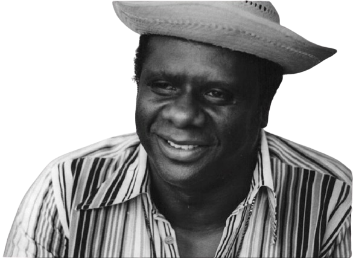

---
---

- 
- | **Full Name**     | Antônio Candeia Filho              |
  |-------------------|------------------------------------|
  | **Date of Birth** | August 17, 1935                    |
  | **Place of Birth**| Rio de Janeiro, RJ, Brazil         |
  | **Genres**        | Samba                              |
  | **Occupations**   | Composer, Singer                   |
  | **Active Years**  | 1953–1978                          |
  | **Record Label**  | Various (Equipe, Tapecar, WEA)     |
- ## **Biography**
	- Antônio Candeia Filho, known as Candeia, was a prominent Brazilian sambista, composer, and singer. Born in Rio de Janeiro, he grew up surrounded by the vibrant samba scene, influenced by his father, Antônio Candeia, a notable flautist. Candeia's early exposure to samba and his involvement with the Portela school shaped his musical career. Despite a tragic incident in 1965 that left him paralyzed, Candeia's dedication to samba remained unwavering, leading to the creation of influential works and the foundation of the Grêmio Recreativo de Arte Negra Escola de Samba Quilombo.
- ## **Career Highlights**
	- **First Composition (1953):** "Seis Datas Magnas," a samba that received top honors at the Portela school.
	- **Debut Album (1970):** Released his first solo album, *Candeia*, featuring significant sambas.
	- **Founding Quilombo (1975):** Co-founded the Grêmio Recreativo de Arte Negra Escola de Samba Quilombo to preserve Afro-Brazilian cultural identity.
	- **Final Album (1978):** Completed *Axé - Gente Amiga do Samba*, regarded as a seminal samba album, shortly before his death.
- ## **Artistic Style and Impact:**
	- Candeia's music is characterized by its deep roots in traditional samba, combined with lyrical themes reflecting social and cultural issues. His work often addressed his experiences and the broader struggles of the Afro-Brazilian community. Candeia's commitment to authentic samba and his role in founding Quilombo underscored his influence in preserving and promoting Afro-Brazilian heritage.
- ## **Gallery**
	- <iframe width="560" height="315" src="https://www.youtube.com/embed/mX2h74pBh2k?si=CHnPjbmbNMddnBTw" title="YouTube video player" frameborder="0" allow="accelerometer; autoplay; clipboard-write; encrypted-media; gyroscope; picture-in-picture; web-share" referrerpolicy="strict-origin-when-cross-origin" allowfullscreen></iframe>
	- <iframe width="560" height="315" src="https://www.youtube.com/embed/jT7-HXWh_u4?si=PnWLi_5vAYyOwUlI" title="YouTube video player" frameborder="0" allow="accelerometer; autoplay; clipboard-write; encrypted-media; gyroscope; picture-in-picture; web-share" referrerpolicy="strict-origin-when-cross-origin" allowfullscreen></iframe>
	- ## Similar artists
		- | Influenced By       | Influenced            |
		  |---------------------|-----------------------|
		  | [[Cartola]]         | [[Martinho da Vila]]     |
		  | Paulo da Portela Clara Nunes           |
		  | [[Nelson Cavaquinho]]| Paulinho da Viola   |