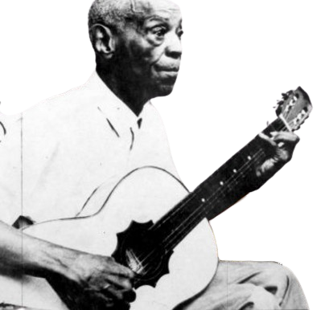

---
---

- ---
  ---
- 
- | **Full Name**     | Ernesto Joaquim Maria dos Santos    |
  |-------------------|------------------------------------|
  | **Date of Birth** | April 5, 1890                      |
  | **Place of Birth**| Rio de Janeiro, RJ, Brazil         |
  | **Genres**        | Samba                              |
  | **Occupations**   | Composer, Guitarist, Banjoist, Cavaquinho Player |
  | **Active Years**  | 1916–1953                          |
  | **Record Label**  | Casa Edison, Parlophon, Odeon      |
- ## **Biography**
	- Ernesto Joaquim Maria dos Santos, known as Donga, was a pioneering Brazilian musician, composer, and guitarist. He is credited with recording the first samba, "Pelo Telefone," in 1916. Donga was a key figure in the early development of samba and was actively involved in influential musical groups such as Oito Batutas and the Orquestra Típica Donga-Pixinguinha.
- ## **Career Highlights**
	- **First Samba Recording (1916):** *Pelo Telefone*
	- **Formation of Oito Batutas (1919):** Toured Europe in 1922, bringing Brazilian music to an international audience.
	- **Notable Collaborations:** Worked with Pixinguinha and other prominent musicians.
	- **Later Years:** Participated in the group Velha Guarda in the late 1950s and contributed to the preservation and celebration of traditional samba.
- ## **Artistic Style and Impact:**
	- Donga's music is characterized by its foundational role in the samba genre, blending Afro-Brazilian rhythms with traditional Brazilian melodies. His contributions helped shape the early sounds of samba and influenced many future generations of Brazilian musicians.
- ## **Gallery**
	- <iframe width="560" height="315" src="https://www.youtube.com/embed/m0LyMqdicj8?si=q19F5mF9rbSFmE0P" title="YouTube video player" frameborder="0" allow="accelerometer; autoplay; clipboard-write; encrypted-media; gyroscope; picture-in-picture; web-share" referrerpolicy="strict-origin-when-cross-origin" allowfullscreen></iframe>
	- <iframe width="560" height="315" src="https://www.youtube.com/embed/ftc3MuqNN_8?si=Jglx33Qx6B5Vw1Po" title="YouTube video player" frameborder="0" allow="accelerometer; autoplay; clipboard-write; encrypted-media; gyroscope; picture-in-picture; web-share" referrerpolicy="strict-origin-when-cross-origin" allowfullscreen></iframe>
	-
- ## Similar artists
	- | Influenced By       | Influenced       |
	  |---------------------|------------------|
	  | [[Pixinguinha]]     | [[Cartola]]         |
	  | João da Baiana  | Paulinho da Viola|
	  | Hilário Jovino Ferreira| [[Martinho da Vila]] |