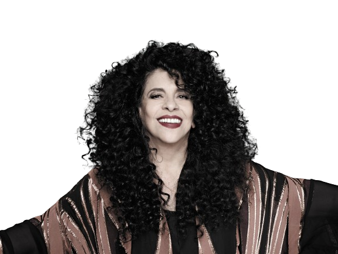

---
---

- 
- | **Full Name**     | Gal Maria da Graça Penna Burgos Costa  |
  |-------------------|-----------------------------------------|
  | **Date of Birth** | September 26, 1945                      |
  | **Place of Birth**| Salvador, BA, Brazil                    |
  | **Date of Death** | November 9, 2022                        |
  | **Genres**        | MPB, Bossa Nova, Samba, Psychedelic Rock|
  | **Occupations**   | Singer, Composer, Multi-instrumentalist |
  | **Active Years**  | 1964–2022                               |
  | **Record Labels** | Odeon, EMI, Universal, RCA, Trama       |
- ## **Biography**
	- Gal Maria da Graça Penna Burgos Costa, born on September 26, 1945, in Salvador, Bahia, Brazil, was a celebrated Brazilian singer and composer. Known as the "Musa da Tropicália," Gal Costa was one of the most versatile and influential Brazilian artists, with a career spanning nearly six decades. She was renowned for her powerful soprano voice and her ability to seamlessly navigate various musical genres.
- ## **Career Highlights**
	- **1967:** Released debut LP *Domingo* with Caetano Veloso.
	- **1968:** Featured in the iconic album *Tropicália ou Panis et Circencis*.
	- **1969:** Released the breakthrough solo album *Gal Costa*, featuring hits like "Baby" and "Divino Maravilhoso."
	- **1973:** Released the influential album *Índia*.
	- **1985:** Achieved commercial success with the album *Profana*.
	- **1997:** Recorded the acclaimed *Acústico MTV*.
	- **2011:** Released the critically acclaimed album *Recanto*, produced by Caetano Veloso.
- ## **Artistic Style and Impact**
	- Gal Costa's music transcended genres, making her a pivotal figure in Brazilian music. Her work in the Tropicalia movement and her collaborations with artists like Caetano Veloso, Gilberto Gil, and Maria Bethânia helped redefine Brazilian music. She was celebrated for her vocal range, emotional delivery, and innovative interpretations of both contemporary and traditional songs.
- ## **Gallery**
	- <iframe width="560" height="315" src="https://www.youtube.com/embed/kbPV3sR9FMI?si=Xnl5uswsQGM4VJgt" title="YouTube video player" frameborder="0" allow="accelerometer; autoplay; clipboard-write; encrypted-media; gyroscope; picture-in-picture; web-share" referrerpolicy="strict-origin-when-cross-origin" allowfullscreen></iframe>
	- <iframe width="560" height="315" src="https://www.youtube.com/embed/jBnedtBKUso?si=bWrEhJFtxMM-D_bj" title="YouTube video player" frameborder="0" allow="accelerometer; autoplay; clipboard-write; encrypted-media; gyroscope; picture-in-picture; web-share" referrerpolicy="strict-origin-when-cross-origin" allowfullscreen></iframe>
	- <iframe width="560" height="315" src="https://www.youtube.com/embed/pn7hKByUsUc?si=5JjK41pxReJ_vXvU" title="YouTube video player" frameborder="0" allow="accelerometer; autoplay; clipboard-write; encrypted-media; gyroscope; picture-in-picture; web-share" referrerpolicy="strict-origin-when-cross-origin" allowfullscreen></iframe>
	- ## Similar Artists
		- | Influenced By        | Influenced                   |
		  |----------------------|------------------------------|
		  | [[João Gilberto]]    | Marisa Monte                 |
		  | [[Elis Regina]]      | Vanessa da Mata              |
		  | [[Caetano Veloso]]   | Adriana Calcanhotto          |