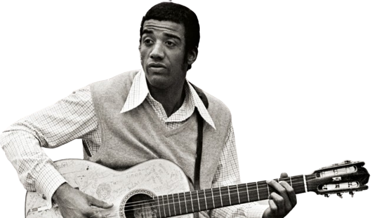

---
---

- 
- | **Full Name**     | Jorge Duílio Lima Meneses         |
  |-------------------|-----------------------------------|
  | **Date of Birth** | March 22, 1939                    |
  | **Place of Birth**| Rio de Janeiro, DF, Brazil        |
  | **Genres**        | Samba, Samba Rock, Bossa Nova, Jazz, Maracatu, Funk, Ska, Hip Hop, Rock and Roll |
  | **Occupations**   | Singer, Composer, Guitarist, Percussionist |
  | **Active Years**  | 1963 – present                    |
  | **Record Labels** | Philips, Universal, Warner        |
- ## **Biography**
	- Jorge Ben Jor, born Jorge Duílio Lima Meneses on March 22, 1939, in Rio de Janeiro, is a renowned Brazilian singer, composer, and guitarist. Known for blending diverse musical styles such as samba, rock, funk, and jazz, he introduced innovative rhythms and sounds to Brazilian music. His hits like "Mas Que Nada" and "Chove Chuva" solidified his status as a musical icon. Despite controversies about his birth year, his influence remains significant, marked by collaborations with international artists and a vibrant solo career.
- ## **Career Highlights**
	- **1963:** Released debut album *Samba Esquema Novo* with hit "Mas Que Nada".
	- **1968:** Gained popularity with songs like "País Tropical" and "Que Maravilha".
	- **1970s:** Released experimental albums *A Tábua de Esmeralda*, *Solta o Pavão*, and *África Brasil*.
	- **1990s:** Rebranded as Jorge Ben Jor and released "W/Brasil (Chama o Síndico)".
	- **2000s:** Continued to release new music and perform live, maintaining a strong presence in the music scene.
- ## **Artistic Style and Impact**
	- Jorge Ben Jor's music is known for its fusion of samba with rock, funk, and jazz elements. His innovative guitar playing and rhythmic complexity have influenced many artists across generations. His work continues to be celebrated for its creativity and cultural significance.
- ## **Gallery**
	- <iframe width="560" height="315" src="https://www.youtube.com/embed/hg0XftC43Zo?si=g-LgW9Q4PEK92Egr" title="YouTube video player" frameborder="0" allow="accelerometer; autoplay; clipboard-write; encrypted-media; gyroscope; picture-in-picture; web-share" referrerpolicy="strict-origin-when-cross-origin" allowfullscreen></iframe>
	- <iframe width="560" height="315" src="https://www.youtube.com/embed/rfrpOhC6858?si=KaI8D0GJWMNbofAW" title="YouTube video player" frameborder="0" allow="accelerometer; autoplay; clipboard-write; encrypted-media; gyroscope; picture-in-picture; web-share" referrerpolicy="strict-origin-when-cross-origin" allowfullscreen></iframe>
	- <iframe width="560" height="315" src="https://www.youtube.com/embed/BVHA2lHaeqk?si=HkncqaT9WegGX8N5" title="YouTube video player" frameborder="0" allow="accelerometer; autoplay; clipboard-write; encrypted-media; gyroscope; picture-in-picture; web-share" referrerpolicy="strict-origin-when-cross-origin" allowfullscreen></iframe>
- ## **Similar Artists**
	- | Influenced By       | Influenced            |
	  |---------------------|-----------------------|
	  | João Gilberto   | [[Martinho da Vila]]  |
	  | [[Tim Maia]]        | [[Seu Jorge]]         |
	  | Luiz Gonzaga    | [[Elza Soares]]       |