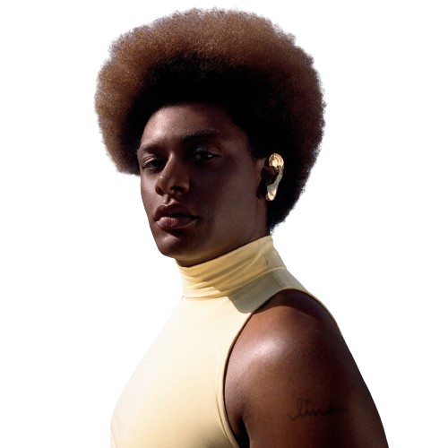

---
---

- 
- | **Full Name**     | Liniker de Barros Ferreira Campos      |
  |-------------------|----------------------------------------|
  | **Date of Birth** | July 3, 1995                           |
  | **Place of Birth**| Araraquara, SP, Brazil                 |
  | **Genres**        | MPB, R&B, Soul, Blues                  |
  | **Occupations**   | Singer, Composer, Actress, Visual Artist|
  | **Instruments**   | Vocals, Guitar                         |
  | **Active Years**  | 2014–present                           |
  | **Affiliations**  | Liniker e os Caramelows                |
- ## **Biography and Career**
	- **Early Life:** Born in Araraquara on July 3, 1995, Liniker was raised in a musical family. Her name honors English footballer Gary Lineker. Liniker discovered her vocal talent through theater during her adolescence.
	- **Musical Beginnings:** In 2015, she formed the band Liniker e os Caramelows, releasing the EP "Cru" and gaining millions of views with the single "Zero." Their debut album "Remonta" (2016) and follow-up "Goela Abaixo" (2019) received critical acclaim.
	- **Solo Career:** In 2021, Liniker released her first solo album, "Indigo Borboleta Anil," featuring collaborations with Milton Nascimento and Tassia Reis. She became the first transgender artist to win a Latin Grammy for Best MPB Album.
	- **Recognition:** Liniker was inducted into the Academia Brasileira de Cultura in 2023, becoming the first transgender artist to occupy a position in the academy.
	- **Activism:** Known for her androgynous visual style, Liniker actively supports LGBTQ+ rights and incorporates themes of identity and acceptance in her work.
- ## **Gallery**
	- <iframe width="560" height="315" src="https://www.youtube.com/embed/CZwZX-QdJ0E?si=6vzPIqYrY9-t1oaC" title="YouTube video player" frameborder="0" allow="accelerometer; autoplay; clipboard-write; encrypted-media; gyroscope; picture-in-picture; web-share" referrerpolicy="strict-origin-when-cross-origin" allowfullscreen></iframe>
	- <iframe width="560" height="315" src="https://www.youtube.com/embed/M4s3yTJCcmI?si=5tCotbZf9YfPrpeP" title="YouTube video player" frameborder="0" allow="accelerometer; autoplay; clipboard-write; encrypted-media; gyroscope; picture-in-picture; web-share" referrerpolicy="strict-origin-when-cross-origin" allowfullscreen></iframe>
	- <iframe width="560" height="315" src="https://www.youtube.com/embed/857vqr0OUKY?si=XyGmdrg3_dqlmIw-" title="YouTube video player" frameborder="0" allow="accelerometer; autoplay; clipboard-write; encrypted-media; gyroscope; picture-in-picture; web-share" referrerpolicy="strict-origin-when-cross-origin" allowfullscreen></iframe>
- ## **Similar Artists**
	- | Influenced By       | Influenced                    |
	  |---------------------|-------------------------------|
	  | [[Elza Soares]]     | Tassia Reis                   |
	  | Johnny Hooker   | Mahmundi                      |
	  | [[Caetano Veloso]]  | Various Brazilian Artists     |