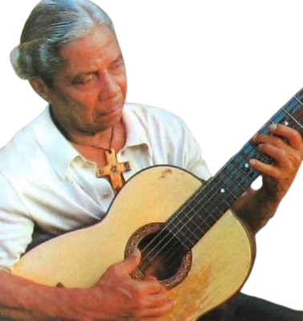

---
---

- 
- | **Full Name**     | Nelson Antônio da Silva             |
  |-------------------|------------------------------------|
  | **Date of Birth** | October 29, 1911                   |
  | **Place of Birth**| Rio de Janeiro, RJ, Brazil         |
  | **Genres**        | Samba                              |
  | **Occupations**   | Composer, Guitarist                |
  | **Active Years**  | 1939–1986                          |
  | **Record Label**  | Discos Castelinho, RCA Victor, Odeon, Eldorado |
- ## **Biography**
	- Nelson Antônio da Silva, known as Nelson Cavaquinho, was a Brazilian composer and guitarist. Initially a cavaquinista, he later developed a unique style of playing the guitar using only two fingers of his right hand. His music often dealt with themes of love, life, and death.
- ## **Career Highlights**
	- **Early Career:** Began his involvement with music through his family's influence. His first recorded song was "Não Faça Vontade a Ela" in 1939.
	- **Mangueira Samba School:** Became an integral part of the Mangueira samba community, collaborating with other famous sambistas like Cartola.
	- **Zicartola (1960s):** Performed regularly at the iconic bar owned by Cartola and Dona Zica, which revitalized his career.
	- **First LP (1970):** Released "Depoimento do Poeta," which solidified his reputation as a profound and influential sambista.
	- **Prolific Composer:** Authored over 400 songs, with notable works like "A Flor e o Espinho," "Folhas Secas," and "Juízo Final."
- ## **Artistic Style and Impact:**
	- Nelson Cavaquinho's music is marked by its simplicity and emotional depth. His lyrics often reflect a melancholic and philosophical view of life, capturing the essence of human experience and mortality. His unique guitar technique and poignant songwriting have left a lasting impact on Brazilian music.
- ## **Gallery**
	- <iframe width="560" height="315" src="https://www.youtube.com/embed/lU8j7lj4RdU?si=ItTq87RNotYq3L2H" title="YouTube video player" frameborder="0" allow="accelerometer; autoplay; clipboard-write; encrypted-media; gyroscope; picture-in-picture; web-share" referrerpolicy="strict-origin-when-cross-origin" allowfullscreen></iframe>
	- <iframe width="560" height="315" src="https://www.youtube.com/embed/E_pAKR3EheM?si=FMD5GASsj49xz9yx" title="YouTube video player" frameborder="0" allow="accelerometer; autoplay; clipboard-write; encrypted-media; gyroscope; picture-in-picture; web-share" referrerpolicy="strict-origin-when-cross-origin" allowfullscreen></iframe>
	- <iframe width="560" height="315" src="https://www.youtube.com/embed/jkLiOjRRCFM?si=KZjQfyn6eqUpvij_" title="YouTube video player" frameborder="0" allow="accelerometer; autoplay; clipboard-write; encrypted-media; gyroscope; picture-in-picture; web-share" referrerpolicy="strict-origin-when-cross-origin" allowfullscreen></iframe>
- ## Similar artists
	- | Influenced By             | Influenced           |
	  |---------------------------|----------------------|
	  | [[Cartola]]               | [[Beth Carvalho]]        |
	  | [[Pixinguinha]]           | Paulinho da Viola    |
	  | João da Baiana        | [[Candeia]]              |