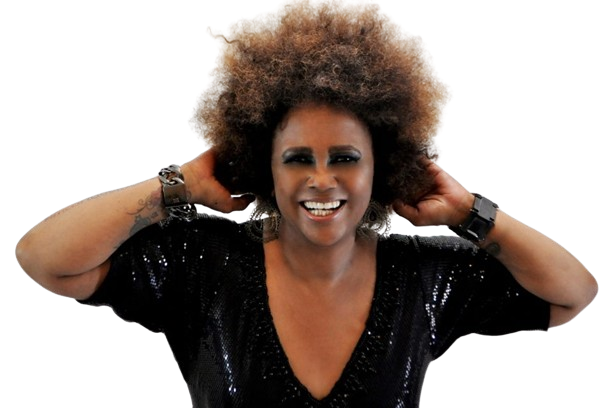

---
---

- ---
  ---
- 
- | **Full Name**     | Sandra Cristina Malafaia Frederico de Sá |
  |-------------------|-------------------------------------------|
  | **Date of Birth** | August 27, 1955                           |
  | **Place of Birth**| Rio de Janeiro, RJ, Brazil                |
  | **Genres**        | MPB, Samba Rock, Soul, Samba, Funk, Pop, Jazz, R&B |
  | **Occupations**   | Singer, Composer, Instrumentalist         |
  | **Active Years**  | 1980–Present                              |
  | **Record Labels** | RGE, WEA, Universal Music, Sony Music, RCA|
  | **Affiliations**  | Tim Maia, Cazuza                          |
- ## **Biography and Career**
	- Sandra Cristina Malafaia Frederico de Sá, born on August 27, 1955, in Rio de Janeiro, is a prominent Brazilian singer and composer known for her powerful voice and versatile music style, blending elements of MPB, soul, and samba. Sandra's father, a drummer, introduced her to music, and she started performing in samba schools and local events in her adolescence.
	- **1980s:** Achieved national fame with the song "Demônio Colorido" in the MPB 80 festival. Known for hits like "Retratos e Canções," "Joga Fora no Lixo," and "Bye Bye Tristeza."
	- **1990s:** Collaborated with artists like Djavan, Marina Lima, and Carlinhos Brown. Introduced the term "Música Preta Brasileira," emphasizing the African roots of Brazilian music.
	- **2000s:** Released albums such as *Momentos que Marcam Demais* and participated in significant events like Rock in Rio and the Independence Day in New York. Developed the "Música Preta Brasileira" project with Toni Garrido and Zé Ricardo.
	- **2010s:** Continued to release music and perform, participating in reality shows like *Dança dos Famosos* and *The Masked Singer Brasil*. Released the album *AfricaNatividade - Cheiro de Brasil*.
	- **2020s:** Released new music and acted in the film *Barraco de Família*. Resumed performing under the name Sandra Sá.
- ## **Artistic Style and Impact**
	- Sandra de Sá is celebrated for her soulful voice and contributions to Brazilian music. She seamlessly blends various genres, reflecting her African heritage and the diversity of Brazilian culture. Known for her dynamic performances and socially conscious lyrics, Sandra has been a significant figure in the Brazilian music scene for decades.
- ## **Gallery**
	- <iframe width="560" height="315" src="https://www.youtube.com/embed/InHcxFCQTeM?si=mI0VHFaBvgExkZAK" title="YouTube video player" frameborder="0" allow="accelerometer; autoplay; clipboard-write; encrypted-media; gyroscope; picture-in-picture; web-share" referrerpolicy="strict-origin-when-cross-origin" allowfullscreen></iframe>
	- <iframe width="560" height="315" src="https://www.youtube.com/embed/dP-0KMjd-dg?si=jRy37qA5aSLe4a5l" title="YouTube video player" frameborder="0" allow="accelerometer; autoplay; clipboard-write; encrypted-media; gyroscope; picture-in-picture; web-share" referrerpolicy="strict-origin-when-cross-origin" allowfullscreen></iframe>
	- <iframe width="560" height="315" src="https://www.youtube.com/embed/ZJpoycqlbjo?si=PiK7GK2H2GfFsk1X" title="YouTube video player" frameborder="0" allow="accelerometer; autoplay; clipboard-write; encrypted-media; gyroscope; picture-in-picture; web-share" referrerpolicy="strict-origin-when-cross-origin" allowfullscreen></iframe>
- ## **Similar Artists**
	- | Influenced By       | Influenced                    |
	  |---------------------|-------------------------------|
	  | [[Tim Maia]]        | Vanessa da Mata               |
	  | [[Cazuza]]          | Negra Li                      |
	  | Marina Lima     | Iza                           |