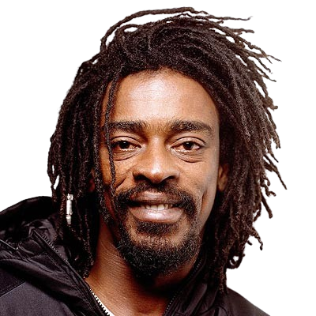

---
---

- 
- | **Full Name**     | Jorge Mário da Silva                  |
  |-------------------|--------------------------------------|
  | **Date of Birth** | June 8, 1970                         |
  | **Place of Birth**| Belford Roxo, RJ, Brazil             |
  | **Genres**        | R&B, MPB, Samba-funk, Soul, Funk, Samba, Samba rock |
  | **Occupations**   | Actor, Singer, Composer, Multi-instrumentalist |
  | **Active Years**  | 1998–present                        |
  | **Record Label**  | Universal Music                     |
- ## **Biography**
	- Seu Jorge, born Jorge Mário da Silva on June 8, 1970, in Belford Roxo, RJ, is a Brazilian actor, singer, composer, and multi-instrumentalist known for his contributions to MPB, R&B, samba, and soul music. He faced a challenging upbringing and early hardships, including a period of homelessness after his brother's death. His musical career began to take shape when he joined the band Farofa Carioca and later pursued a solo career. Seu Jorge has also achieved success as an actor, appearing in films like *Cidade de Deus* and *The Life Aquatic with Steve Zissou*.
- ## **Career Highlights**
	- **Farofa Carioca (1998):** Joined the band, contributing to their debut album *Moro no Brasil*.
	- **Solo Career (2001):** Released his first solo album, *Samba Esporte Fino*, followed by several successful albums.
	- **Film Appearances:** Notable roles in *Cidade de Deus*, *The Life Aquatic with Steve Zissou*, and *Tropa de Elite 2*.
	- **Awards and Recognition:** Winner of multiple awards, including the Latin Grammy and Prêmio Multishow de Música Brasileira.
	- **Entrepreneurial Ventures:** Co-owner of the Karavelle brewery and two bars in São Paulo.
- ## **Artistic Style and Impact:**
	- Seu Jorge's music blends various genres, creating a unique sound that resonates with a wide audience. His ability to incorporate elements of samba, funk, and soul has earned him critical acclaim and a loyal fanbase. He is known for his powerful vocals and versatility in playing multiple instruments, including the guitar, bass, and clarinet.
- ## **Gallery**
	- <iframe width="560" height="315" src="https://www.youtube.com/embed/AwA-rWdPi-g?si=Hxpa2kx1YOcX2IaW" title="YouTube video player" frameborder="0" allow="accelerometer; autoplay; clipboard-write; encrypted-media; gyroscope; picture-in-picture; web-share" referrerpolicy="strict-origin-when-cross-origin" allowfullscreen></iframe>
	- <iframe width="560" height="315" src="https://www.youtube.com/embed/prNwKbJNL2g?si=w58X16Q91sP2QmW6" title="YouTube video player" frameborder="0" allow="accelerometer; autoplay; clipboard-write; encrypted-media; gyroscope; picture-in-picture; web-share" referrerpolicy="strict-origin-when-cross-origin" allowfullscreen></iframe>
	- <iframe width="560" height="315" src="https://www.youtube.com/embed/PJkQtr5TRaA?si=_4veomDo-JPYjLwh" title="YouTube video player" frameborder="0" allow="accelerometer; autoplay; clipboard-write; encrypted-media; gyroscope; picture-in-picture; web-share" referrerpolicy="strict-origin-when-cross-origin" allowfullscreen></iframe>
	- <iframe width="560" height="315" src="https://www.youtube.com/embed/eWzz_bYLRBA?si=ICQ1CwZHMDZEATz1" title="YouTube video player" frameborder="0" allow="accelerometer; autoplay; clipboard-write; encrypted-media; gyroscope; picture-in-picture; web-share" referrerpolicy="strict-origin-when-cross-origin" allowfullscreen></iframe>
	-
	- ## Similar artists
		- | Influenced By       | Influenced            |
		  |---------------------|-----------------------|
		  | Jovelina Pérola Negra | Marcelo D2       |
		  | [[Tim Maia]]         | Planet Hemp          |
		  | [[Gilberto Gil]]     | Ana Carolina         |